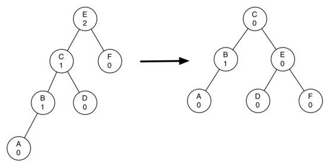

Information

Author: Leandro Wolff
Fecha: 20/06/2021
Facultad de Ingeniería, Universidad de Buenos Aires
7541 - Algoritmos y Programación II - Mendez

# TDA - ABB (Arbol Binario de Busqueda) :trophy:

## Introducción :raised_hand:

Este TDA `(Tipo de Dato Abstracto)` Es un arbol binario de busqueda un tipo de estructura de datos que consiste en un arbol con su respectiva raiz y maximo 2 hijos, el cual va ordenando segun un comparador brindado por el usuario, a que lado (derecho o izquierdo) del nodo hoja sera insertado. Esto nos permite tener una complejidad algoritimica en el caso del mejor caso: `O(log n)` y en el peor de los casos, que seria cuando el arbol se va degenerando a lista `O(n)`, dentro de sus primtivas de busqueda, insercion y borrado.

## Objetivo :heavy_check_mark:

- El objetivo principal del TDA es la implementacion y el testing de 1 estructura de datos fundamental como son los arboles, en este caso un *ABB*, entender su correcto funcionamiento y analizar los beneficios que nos podria brindar estas estructuras con respecto a otras.

## Tipos de Arboles (Mas Comunes) :scroll:

### Arboles No Auto-Balanceables :evergreen_tree:

#### 1. Arbol General

Un arbol general es una coleccion *n* de nodos donde este nodo puede tener *n* hijos, que representan los elementos del arbol y que tienen en comun una raiz `(un nodo ancestro)` exceptuando el nodo raiz comunmente llamado padre.

#### 2. Arbol Binario

Un arbol general es una coleccion *n* de nodos donde cada nodo puede tener como maximo *2* hijos, que representan los elementos del arbol y que tienen en comun una raiz `(un nodo ancestro)` exceptuando el nodo raiz comunmente llamado padre. Estos estan relacionados fuertemente con las operaciones de busqueda. Existen 3 tipos de recorridos para estos tipos de arboles los cuales son:

- Preorden: Primero se visita en nodo actual luego el sub-árbol izquierdo y luego el derecho. 
- Inorden: Primero se visita el sub-árbol izquierdo, luego el nodo actual y por último el sub-árbol derecho.
- Postorden: Primero se visita el sub-árbol izquierdo, luego al sub-arbol derecho y por último al nodo actual.

#### 3. ABB (Arbol Binario de Busqueda)

El arbol binario por si solo sin alguna regla para insertar los elementos no es muy util, por eso esta el ABB ya que este implementa una regla de comparacion para ver a que lado del arbol deberia insertar los nodos a medida que los va agregando. Esto mejora la complejidad dependiendo de como se haya insertado los elementos en el arbol siendo su peor caso `O(n)` y el mejor `O(log n)`

### Extra: Factor de Balanceo 	:arrows_counterclockwise:

El factor de balanceo nos permite saber si un arbol esta balanceado o no, y sueles ser usado para algunos arboles autobalanceados, este factor nos calcula si el arbol esta balanceado su factor de balanceo deberia ser 0, 1 o -1, en caso contrario esta desbalanceado su formula es la siguiente:

- `Factor de Balanceo = (altura sub-arbol derecho - altura sub-arbol izquierdo)`

### Arboles Auto-Balanceables :palm_tree:

#### 1. AVL (Arbol Adelson-Velsky) 

Es un arbol binario de busqueda auto-balanceado, utiliza el factor de balanceo previamente planteado si |Factor Balanceo| >= 2 se debe re-equilibrar el arbol, para poder re-equilibrar el mismo se utilizan las rotaciones, que segun el caso planteado se implementa cierta rotacion, estos casos son:

- Caso 1: Rotación Simple a Derecha: Este caso ocurre cuando la altura del hijo izquierdo de un nodo es 2 mayor que la del hijo derecho, y el hijo izquierdo está equilibrado o pesa a la izquierda. Se puede arreglar usando una sola operación de rotación hacia la derecha en el nodo desequilibrado.

- Caso 2: Rotacion Simple a Izquierda: Este caso ocurre cuando la altura del hijo derecho de un nodo se vuelve 2 veces mayor que la del hijo izquierdo, y el hijo derecho es equilibrado o derecho-pesado. Este es el inverso del caso izquierdo izquierdo. Se puede arreglar usando una sola operación de rotación hacia la izquierda en el nodo desequilibrado.

- Caso 3: Rotación Izquierda - Derecha: Este caso ocurre cuando la altura del hijo izquierdo de un nodo es 2 mayor que la del hijo derecho, y el hijo izquierdo pesa a la derecha. Puede fijarse con un giro a la izquierda en el lado izquierdo, lo que da como resultado el caso izquierdo a la izquierda, que se fija con un giro a la derecha en el nodo desequilibrado.

- Caso 4: Rotación Derecha - Izquierda: Este caso ocurre cuando la altura del hijo derecho de un nodo se vuelve 2 veces mayor que la del hijo izquierdo, y el hijo derecho pesa más en la izquierda. Este es el inverso del caso de la izquierda derecha. Se puede arreglar usando una rotación hacia la derecha en el lado derecho derecho, lo que da como resultado el caso derecho a la derecha que se fija mediante una rotación hacia la izquierda en el nodo no equilibrado.

#### 2. Arbol Rojo-Negro 

Es un arbol binario de busqueda auto-balanceado, que implementa 2 colores `(rojo o negro)` para cada nodo, la utilizacion de los colores es lo que permite el balanceo de este arbol, para esto es aplicado una cierta cantidad de reglas las cuales son:

- Todo nodo es o bien rojo o bien negro.
- La raı́z es negra.
- Todas las hojas (NULL) son negras.
- Todo nodo rojo debe tener dos nodos hijos negros. No hay dos nodos rojos adyacentes.
- Cualquier camino desde un nodo dado a sus hojas descendientes contiene el mismo número de nodos negros.

#### 3. Arbol B 

ES un arbol de busqueda balanceado, pero donde cada nodo puede poseer mas de 2 hijos, nacen a partir de la necesidad de tener un número muy grande de elementos en los cuales hay que realizar dicha operación, con el que este número tan grande de elementos no entra completamente en memoria, debe cumplir las siguientes caracteristicas:

- El nodo raı́z tiene entre 2 y M ramas descendientes.
- Todos los nodos (excepto la raı́z) tienen entre (M + 1) división entera entre 2 y M ramas descendientes.
- Todos los nodos (excepto la raiz) tienen entre (M - 1) división entera entre 2 y ( M - 1 ) claves.
- El número de claves en cada nodo es siempre una unidad menor que el número de sus ramas.
- Todas las ramas que parten de un determinado nodo tienen exactamente la misma altura.
- En los nodos las claves se encuentran clasificadas y además, a su vez, clasifican las claves almacenadas en los nodos descendientes.

## Implementación :hammer:

Para la implementación de este TDA se brindo el `contrato` con las primitivas del ABB y se planteo el uso de una Metodologia parecida a TDD `(Test Driven Development)`,  Con la cual primero creabamos los tests adecuados para cada primitiva del ABB, evaluando los casos base, una vez el test no corria, se iba a la implementacion y se iba programando la misma, asi continuamente, hasta desarrollar todas estas primitivas, para la misma implementación tuve que modularizar parte del codigo, prinicipalmente para las funciones del uso de los nodos, ya que podia reutilizarlas, principalmente el crear, insertar, buscar y destruir. Luego muchas de las funciones que ya habian sido programadas las pude reutilizar para la misma estructura.
