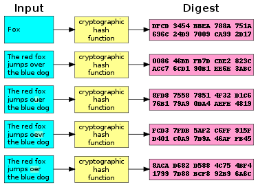
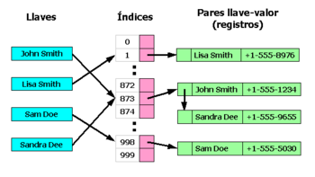

Information

Author: Leandro Wolff
Fecha: 20/06/2021
Facultad de Ingeniería, Universidad de Buenos Aires
7541 - Algoritmos y Programación II - Mendez

# TDA - Tabla de Hash :trophy:

## Introducción :raised_hand:

Este TDA `(Tipo de Dato Abstracto)` Es una tabla de hash un tipo de estructura de datos que consiste en una estructura donde guardaremos los pares ***clave y valor***, el cual segun la funcion de hash brindada va asignando la posicion adecuada donde se encontrara este dato. Esto nos permite tener una complejidad algoritimica en el caso del mejor caso: `O(log 1)` y en el peor de los casos `O(n)`, dentro de sus primtivas de busqueda, insercion y borrado.

## Objetivo :heavy_check_mark:

- El objetivo principal del TDA es la implementacion y el testing de 1 estructura de datos fundamental como es la tabla de Hash, en este caso un *Hash Cerrado*, entender su correcto funcionamiento y analizar los beneficios que nos podria brindar estas estructuras con respecto a otras.

## Tipos de Hash :scroll:

### Hash Cerrado

El hash cerrado o direccionamiento abierto, es una forma de resolver las colisiones donde guarda todos los pares (clave-valor) dentro de su misma tabla, en caso de que los elementos superen el factor de carga de la tabla se usa un rehasheo que dependiendo de como este implementado se agranda el tamano de la tabla para que puedan seguir insertando valores.

- Funcion de hash

Una funcion de hash nos modifica nuestro elemento para convertirlo en otro elemento, en este caso nos lo convierte en un numero que sera la posicion ideal donde sera insertado nuestro elemento.

- Factor de Carga

Es la fraccion ocupada de la tabla y es un numero entre 0 y 1 si esta vacia o si esta llena respectivamente, en nuestra implementacion cuando nuestro factor de carga excede los 0.75 se utiliza el rehash.

- Rehashing

El rehash se utiliza cuando nuestro factor de carga supera cierta cantidad, es una operacion bastante costosa ya que lo que hace justamente es agrandar el tamano de nuestra tabla e insertar todos los valores nuevamente, ya que nuestra funcion de hash depende justamente del tamano de la tabla.

### Hash Abierto

El hash abierto o direccionamiento cerrado, es otra forma de resolver las colisiones en este caso en vez de guardar nuestros pares (clave-valor) dentro de una tabla, vamos guardandolo dentro de una tabla con listas donde dependiendo de la funcion de hash se va anadiendo los elementos a la lista indicada. no es necesario agrandar nuestro tamano de tabla ya que con las listas integradas a la tabla se van agregando mas elementos sin la necesitad de agrandar la tabla.

## Implementación :hammer:

Para la implementación de este TDA se brindo el `contrato` con las primitivas de la tabla del hash y se planteo el uso de una Metodologia parecida a TDD `(Test Driven Development)`,  Con la cual primero creabamos los tests adecuados para cada primitiva de la tabla del hash, evaluando los casos base, una vez el test no corria, se iba a la implementacion y se iba programando la misma, asi continuamente, hasta desarrollar todas estas primitivas, para la misma implementación tuve que modularizar parte del codigo, prinicipalmente para las funciones del uso de los nodos, ya que podia reutilizarlas, principalmente el crear, insertar, buscar y destruir. Luego muchas de las funciones que ya habian sido programadas las pude reutilizar para la misma estructura.
