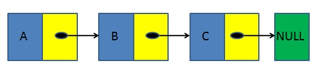
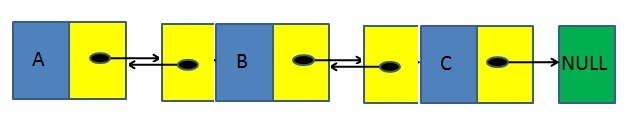
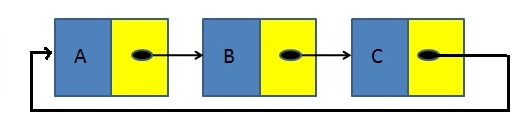
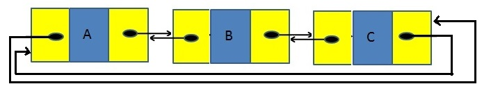

Information

Author: Leandro Wolff
Fecha: 30/05/2021
Facultad de Ingeniería, Universidad de Buenos Aires
7541 - Algoritmos y Programación II - Mendez

# TDA - Lista :trophy:

## Introducción :raised_hand:

Este TDA `(Tipo de Dato Abstracto)` Es una lista enlazada simple un tipo de estructura de datos que consiste en una secuencia de nodos enlazados, donde en uno de los campos se guarda el puntero al dato arbitrario y en el otro campo se guarda el puntero al nodo proximo.

## Objetivo :heavy_check_mark:

- El objetivo principal del TDA es la implementacion y el testing de 3 estructuras de datos fundamentales como lo son las pilas, las colas y las listas, entender su correcto funcionamiento y analizar los beneficios que nos podria brindar estas estructuras con respecto a otras.

## Tipos de Listas :scroll:

### 1. Listas Enlazadas Simples :arrow_right:

Esta lista de nodos enlazados esta definida porque cada nodo tiene un unico campo donde contiene el puntero al siguiente nodo enlazado, asi consecutivamente hasta llegar al final de la lista donde tiene un puntero a VACIO.

### 2. Listas Doblemente Enlazadas :left_right_arrow:

Esta lista de nodos enlazados es muy parecida a la vista en el primer punto. pero en este caso los nodos enlazados tiene 2 unicos campos donde estan almacenados los punteros del nodo previo y el nodo proximo, en este caso el nodo inicial, su campo de nodo previo estara apuntando a VACIO y en el caso del nodo final su nodo proximo estará apuntando igual al VACIO.

### 3. Listas Enlazadas Simples Circulares :arrows_counterclockwise:

Esta lista es similar a la lista enlazada simple excepto porque el fin de la lista tiene el nodo enlazado al nodo del principio de la lista.

### 4. Listas Doblemente Enlazadas Circulares :repeat:

Esta lista es similar a la lista doblemente enlazada, excepto porque el fin de la lista tiene el nodo proximo enlazado al nodo del principio de la lista, y viceversa el nodo previo del principio de la lista esta enlazado al nodo del fin de la lista.

## Implementación 

Para la implementación de este TDA se brindo el `contrato` con las primitivas de la misma lista y se planteo el uso de una Metodologia parecida a TDD `(Test Driven Development)`,  Con la cual primero creabamos los tests adecuados para cada primitiva de la lista, evaluando los casos base, una vez el test no corria, se iba a la implementacion y se iba programando la misma, asi continuamente, hasta desarrollar todas estas primitivas, para la misma implementación tuve que modularizar parte del codigo, prinicipalmente para las funciones del uso de los nodos, ya que podia reutilizarlas, principalmente el crear, modificar y destruir. Luego muchas de las funciones que ya habian sido programadas las pude reutilizar para las estructuras LIFO `(Last In First Out)` como es la pila y FIFO `(First In First Out)` como es la cola, y por ultimo la implemetancion de iteradores internos y externos.
