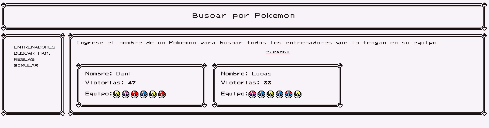

<details>
<summary>
Information
</summary>
Author: Wolffoner
Fecha: 10/08/2021
Facultad de Ingeniería, Universidad de Buenos Aires
7541 - Algoritmos y Programación II - Mendez
</details>

# Salon de la Fama Reloaded :trophy:

## Introducción :raised_hand:

Este TP `(trabajo teorico-practico)` consiste en el desarrollo de una API `(Application Programming Interface)` para la escritura y lectura de archivos con un formato previamente establecido. Su tematica es un salon de la fama donde se llevara el registro, de los entrenadores que han vencido el alto mando junto con sus respectivos pokemones. esta API sera consumida localmente en una web modificada para mostrar los registros y sus comandos respectivamente.

## Objetivo :heavy_check_mark:

- El objetivo principal del TP es la implementacion de los temas previamente vistos en Lenguaje C, y la correcta implementacion de distintos TDAs para lograr el mejor resultado en cuanto a los requerimientos y necesidades propuestos para el TP, dentro de los temas mas importantes se tiene en cuenta: 
  - Manejo de Archivos.
  - Estructuras de datos. 
  - Analisis de Algoritmos.
  - Gestion de Memoria.
  - Punteros.
  - Aritmetica de Punteros.
  - Casteo de tipos.
  - Tipos de datos abstractos. 

## Sub-Carpetas

### /src

Dentro de la carpeta src `(source)` encontraras todas las estructuras y tipos de datos abstractos utilizados, se utilizaron los 3 TDAs `(Lista, Arbol Binario, Tabla de hash)` y 3 tipos de datos creados por mi `(comando, entrenador, pokemon)` para el manejo del salon. 

### /salones

Dentro de la carpeta salones encontraras los archivos de texto con los salones que seran procesados para el testeo de distintas pruebas.

### /requirements

Dentro de la carpeta encontraras el archivo comandos.txt y los requerimientos previamente establecidos para el desarrollo del tp.

### /tests

Dentro de la carpeta encontraras los tests para las estructuras de datos creadas por mi, para correr los tests:

- ***make valgrind_e*** nos corre todos los tests para la estructura entrenador.
- ***make valgrind_p*** nos corre todos los tests para la estructura pokemon.
- ***make valgrind_c*** nos corre todos los tests para la estructura comando.

### /imgs

Dentro de la carpeta encontraras todas las capturas tomadas a modo demo del servidor corriendo.

## Condiciones Previas :lock:

### Archivos
El formato del contenido de los registros guardado en los archivos, debe ser el siguiente,
para entrenadores:
```
nombre;victorias
```
para pokemones:
```
nombre;nivel;fuerza;defensa;inteligencia;velocidad
```
Donde la primera linea del archivo ***SIEMPRE*** debe ser un entrenador y las lineas siguientes los Pokemones del mismo entrenador hasta que consiga una linea con el siguiente entrenador.

## Compilacion y Ejecucion :hammer:

### Utilidades

Para poder correr nuestro makefile, deben estar instalados las siguientes utilidades:

- ***make***
- ***Valgrind***
- ***gcc***

### Compilacion y Ejecucion

Para compilarlo y ejecutarlo hay un archivo makefile, para automatizar nuestras pruebas sugeridas:

- Compilar pruebas:
```
make pruebas
```
- Ejecutar pruebas:
```
make valgrind
```
- Compilar server:
```
make server
```
- Ejecutar servidor:
```
make valgrind-server
```

## Comandos

En el siguiente enlace conseguiras los comandos que se utilizan dentro del servidor para obtener los datos del salon:

- [Comandos](./requirements/comandos.txt)

## Analisis :scroll:

### Por que se uso un arbol binario para guardar entrenadores?

Se uso un arbol binario, ya que este dependiendo del comparador en este caso los nombres de los entrenadores, a medida que se van agregando mas entrenadores podemos hacer un recorrido INORDEN para obtener todos los entrenadores de mayor a menor sin complicarnos con luego tener que ordenar alguna estructura que nos puede aumentar considerablemente nuestra complejidad algoritmica, el arbol nos da una bondad excelente para guardar los entrenadores sin embargo, tiene desventajas ya que el salon necesita verificar si tiene duplicados, cuando esto en una tabla de hash no es necesario verificarlo, pero la tabla no tiene ningun orden por los que nos seria mas complicado traer los datos ordenados.

### Por que se uso una lista para guardar los pokemones del entrenador?

Se uso una lista ya que es bastante comodo para la obtencion del primer pokemon que quiere empezar la batalla, si se utiliza un hash no tendria un orden los pokemones que van a batallar y tampoco nos permitiria repetir pokemones cosa que si es posible, un entrenador puede tener por ejemplo: 2 pikachus y es totalmente correcto.

### Porque se uso una tabla de hash para guardar los comandos?

Se uso una tabla de hash para los comandos, ya que nos permite guardar los comandos necesarios y nos permite obtenerlos con una complejidad de O(1) en el mejor de los casos y O(n) en el peor, solo con su clave `(nombre del comando)` se obtiene el comando. Como los comandos no estan repetidos ni necesitan un orden la tabla de hash es perfecta para este caso.

## Preview

- Entrenadores


- Equipo


- Busqueda por Pokemon


- Reglas


- Simulador


- Batalla

